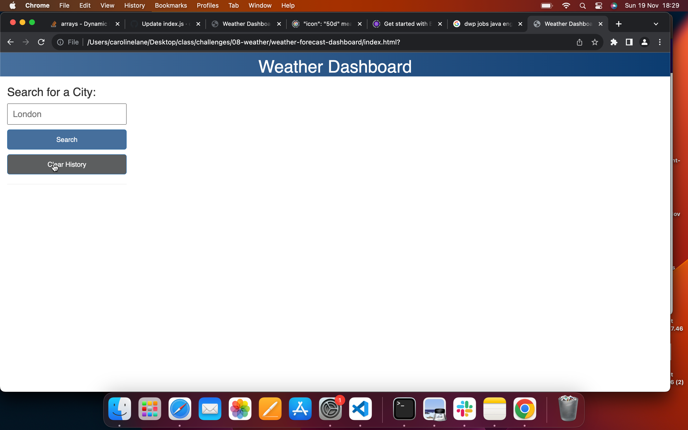
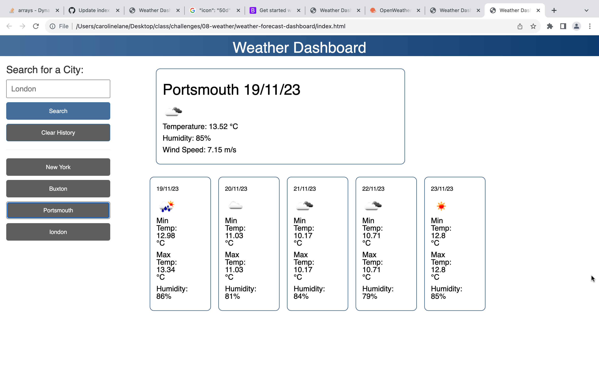

# weather-forecast-dashboard

A weather dashboard that runs in the browser and feature dynamically updated HTML and CSS.

https://cazbella.github.io/weather-forecast-dashboard/

## Usage

Upon loading the application the user is faced with the following page. 

1. There is a form input for the current city. 

2. When a user searches for a city and presses enter/click's search, they are presented with current and future conditions for that city and that city is added to the search history. This is shown in the screenshot below. 

When a user views the current weather conditions for that city they are presented with:

* The city name
* The date
* An icon representation of weather conditions
* The temperature
* The humidity
* The wind speed

When a user views future weather conditions for that city they are presented with a 5-day forecast underneath the weather now that displays:

* The date
* An icon representation of weather conditions
* The maxumim temperature
* The minimum temperature
* The humidity

3. When a user clicks on a city in the search history they are again presented with current and future conditions for that city.

## Challenges

I have been getting used to working with APIs and have found this new dimension challenging this week. Please see the information below for more details. 

__A Note about the API key__
_____________________________

I had a few issues as my repository contains an API key. I am aware that this is a security risk and that we need to learn in future how to ensure that this sensitive informtion is not committed to GitHub. In future I will use a GitIgnore file to hide this. As no card details were provided this time, I will just deactivate the keys after use. 

__A Note about Bootstrap__
_____________________________

Although we studied bootstrap in class, the implications of classes and versions are just becomming apparent to me by working with it. I need to work further with the classes and versions on this project in order to learn more about bootstrap and responsiveness. I have learned that the classes provided in the starter code are bootstrap 3/4 classes, and when I contacted Ask BCS they provided me with the CDN for bootstrap 3. I have been unable to make the project as responsive as I would have liked, but I do feel more informed about how to implement this in the future after reading more about it. 

__A Note about Improvements__
_____________________________

In future I would like to add code that enables the user to 'set home city' and for this to load every time when the user views the page. I would also like to improve location information so that the correct information is always displayed. I would also like to add a function to capitlise input using .toUpperCase and .slice. I would also like to investigate making an autocomplete form for the search box. I have researched both of these and they are possible, but I didn't want to copy large chunks of code from the web so want to practise with these things first. 

__A Note about Pseudocode__
_____________________________

The JavaScript files that contain this code contains lots of comments. The tutor was asked if this was good practice and the advice given was that as I am new to web development, there should be lots of comments at this stage. Hopefully the comments and the commits explain the process I followed to complete the assignment. I have also made notes here to help me remember the process and what the syntax means. 

# References 
reset css stylesheet
https://meyerweb.com/eric/tools/css/reset/
https://getbootstrap.com/docs/5.0/components/buttons/
https://stackoverflow.com/questions/73672814/dynamic-bootstrap-cards-with-javascript
https://www.pluralsight.com/blog/data-professional/using-jquery-css-method
https://stackoverflow.com/questions/40806692/dynamically-create-rows-and-columns-in-bootstrap-rails
https://www.geeksforgeeks.org/difference-between-bootstrap-3-and-bootstrap-4/
https://stackoverflow.com/questions/44177417/how-to-display-openweathermap-weather-icon

I also used some code from our tutor session this week. 

## Contributing

I would very much appreciate some feedback on the methods I have used to achieve the task. Is this the most concise code I could have used? I would also like to know if the readme layout and content was appropriate for the task if possible please. 

## License

[MIT](https://choosealicense.com/licenses/mit/)

